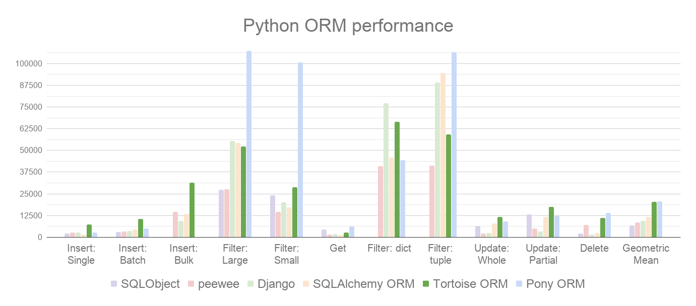

# Identification of semantic traces

        ⣇⣿⠘⣿⣿⣿⡿⡿⣟⣟⢟⢟⢝⠵⡝⣿⡿⢂⣼⣿⣷⣌⠩⡫⡻⣝⠹⢿⣿⣷      Identification of semantic traces of objects
        ⡆⣿⣆⠱⣝⡵⣝⢅⠙⣿⢕⢕⢕⢕⢝⣥⢒⠅⣿⣿⣿⡿⣳⣌⠪⡪⣡⢑⢝⣇      that create threats in test streams
        ⡆⣿⣿⣦⠹⣳⣳⣕⢅⠈⢗⢕⢕⢕⢕⢕⢈⢆⠟⠋⠉⠁⠉⠉⠁⠈⠼⢐⢕⢽
        ⡗⢰⣶⣶⣦⣝⢝⢕⢕⠅⡆⢕⢕⢕⢕⢕⣴⠏⣠⡶⠛⡉⡉⡛⢶⣦⡀⠐⣕⢕
        ⡝⡄⢻⢟⣿⣿⣷⣕⣕⣅⣿⣔⣕⣵⣵⣿⣿⢠⣿⢠⣮⡈⣌⠨⠅⠹⣷⡀⢱⢕      LO object editor with behavior model.
        ⡝⡵⠟⠈⢀⣀⣀⡀⠉⢿⣿⣿⣿⣿⣿⣿⣿⣼⣿⢈⡋⠴⢿⡟⣡⡇⣿⡇⡀⢕      Training models of test flows.
        ⡝⠁⣠⣾⠟⡉⡉⡉⠻⣦⣻⣿⣿⣿⣿⣿⣿⣿⣿⣧⠸⣿⣦⣥⣿⡇⡿⣰⢗⢄      Identification based on the theory of semantic interpretation
        ⠁⢰⣿⡏⣴⣌⠈⣌⠡⠈⢻⣿⣿⣿⣿⣿⣿⣿⣿⣿⣿⣬⣉⣉⣁⣄⢖⢕⢕⢕
        ⡀⢻⣿⡇⢙⠁⠴⢿⡟⣡⡆⣿⣿⣿⣿⣿⣿⣿⣿⣿⣿⣿⣿⣿⣿⣿⣷⣵⣵⣿
        ⡻⣄⣻⣿⣌⠘⢿⣷⣥⣿⠇⣿⣿⣿⣿⣿⣿⠛⠻⣿⣿⣿⣿⣿⣿⣿⣿⣿⣿⣿
        ⣷⢄⠻⣿⣟⠿⠦⠍⠉⣡⣾⣿⣿⣿⣿⣿⣿⢸⣿⣦⠙⣿⣿⣿⣿⣿⣿⣿⣿⠟
        ⡕⡑⣑⣈⣻⢗⢟⢞⢝⣻⣿⣿⣿⣿⣿⣿⣿⠸⣿⠿⠃⣿⣿⣿⣿⣿⣿⡿⠁⣠
        ⡝⡵⡈⢟⢕⢕⢕⢕⣵⣿⣿⣿⣿⣿⣿⣿⣿⣿⣶⣶⣿⣿⣿⣿⣿⠿⠋⣀⣈⠙
        ⡝⡵⡕⡀⠑⠳⠿⣿⣿⣿⣿⣿⣿⣿⣿⣿⣿⣿⣿⣿⣿⠿⠛⢉⡠⡲⡫⡪⡪⡣

        The technology stack includes:                                      ⣿⣿⣷⡁⢆⠈⠕⢕⢂⢕⢂⢕⢂⢔⢂⢕⢄⠂⣂⠂⠆⢂⢕⢂⢕⢂⢕⢂⢕⢂ 
              Backend:                                                      ⣿⣿⣿⡷⠊⡢⡹⣦⡑⢂⢕⢂⢕⢂⢕⢂⠕⠔⠌⠝⠛⠶⠶⢶⣦⣄⢂⢕⢂⢕  
                -| FastApi          [https://fastapi.tiangolo.com/]         ⣿⣿⠏⣠⣾⣦⡐⢌⢿⣷⣦⣅⡑⠕⠡⠐⢿⠿⣛⠟⠛⠛⠛⠛⠡⢷⡈⢂⢕⢂  
                -| PostgreSQL       [https://www.postgresql.org/]           ⠟⣡⣾⣿⣿⣿⣿⣦⣑⠝⢿⣿⣿⣿⣿⣿⡵⢁⣤⣶⣶⣿⢿⢿⢿⡟⢻⣤⢑⢂  
                -| Pony ORM         [https://ponyorm.org/]                  ⣾⣿⣿⡿⢟⣛⣻⣿⣿⣿⣦⣬⣙⣻⣿⣿⣷⣿⣿⢟⢝⢕⢕⢕⢕⢽⣿⣿⣷⣔  
                -| TensorFlow       [https://www.tensorflow.org/?hl=ru]     ⣿⣿⠵⠚⠉⢀⣀⣀⣈⣿⣿⣿⣿⣿⣿⣿⣿⣿⣗⢕⢕⢕⢕⢕⢕⣽⣿⣿⣿⣿  
                                                                            ⢷⣂⣠⣴⣾⡿⡿⡻⡻⣿⣿⣴⣿⣿⣿⣿⣿⣿⣷⣵⣵⣵⣷⣿⣿⣿⣿⣿⣿⡿  
              Frontend:                                                     ⢌⠻⣿⡿⡫⡪⡪⡪⡪⣺⣿⣿⣿⣿⣿⠿⠿⢿⣿⣿⣿⣿⣿⣿⣿⣿⣿⣿⣿⠃ 
                -| Vue/cli@5.0.8    [https://cli.vuejs.org/guide/#cli]      ⠣⡁⠹⡪⡪⡪⡪⣪⣾⣿⣿⣿⣿⠋⠐⢉⢍⢄⢌⠻⣿⣿⣿⣿⣿⣿⣿⣿⠏⠈  
                -| Bootstrap@5.2.3  [https://getbootstrap.com/]             ⡣⡘⢄⠙⣾⣾⣾⣿⣿⣿⣿⣿⣿⡀⢐⢕⢕⢕⢕⢕⡘⣿⣿⣿⣿⣿⣿⠏⠠⠈  
                -| Axios@1.2.1      [https://www.npmjs.com/package/axios]   ⠌⢊⢂⢣⠹⣿⣿⣿⣿⣿⣿⣿⣿⣧⢐⢕⢕⢕⢕⢕⢅⣿⣿⣿⣿⡿⢋⢜⠠⠈  
                -| Vuex@4.1.0       [https://www.npmjs.com/package/vuex]    ⠄⠁⠕⢝⡢⠈⠻⣿⣿⣿⣿⣿⣿⣿⣷⣕⣑⣑⣑⣵⣿⣿⣿⡿⢋⢔⢕⣿⠠⠈
                                                                            ⠨⡂⡀⢑⢕⡅⠂⠄⠉⠛⠻⠿⢿⣿⣿⣿⣿⣿⣿⣿⣿⡿⢋⢔⢕⢕⣿⣿⠠⠈   
              DevOps: Docker                                                ⠄⠪⣂⠁⢕⠆⠄⠂⠄⠁⡀⠂⡀⠄⢈⠉⢍⢛⢛⢛⢋⢔⢕⢕⢕⣽⣿⣿⠠⠈   

## Current project version <a> [0.0.0] </a>

 Project based on Python <a> 3.10.0 </a>

    ├── docker-compose.yml
    ├── LICENSE
    ├── README.md
    ├── backend
    │   ├── Dockerfile
    │   ├── requirements.txt
    │   └── src
    │       ├── settings.py
    │       ├── srv.py
    │       ├── database
    │       │   ├── config.py
    │       │   ├── crud.py
    │       │   ├── models.py
    │       │   ├── postgres_script.sql
    │       │   └── register.py
    │       ├── lsa
    │       │   └── identification.py
    │       ├── routing
    │       │   └── pages.py
    │       └── telegram
    │           └── parser.py
    └── frontend
        ├── .gitignore
        ├── Dockerfile
        ├── README.md
        ├── babel.config.js
        ├── jsconfig.json
        ├── package-lock.json
        ├── package.json
        ├── public
        │   ├── favicon.ico
        │   └── index.html
        ├── src
        │   ├── App.vue
        │   ├── assets
        │   │   └── logo.png
        │   ├── components
        │   │   └── HelloWorld.vue
        │   ├── main.js
        │   ├── router
        │   │   └── index.js
        │   └── views
        │       ├── AboutView.vue
        │       └── HomeView.vue
        └── vue.config.js

### Было использовано Pony ORM для ORM (Object Relational Mapper) и для управления миграциями баз данных.

